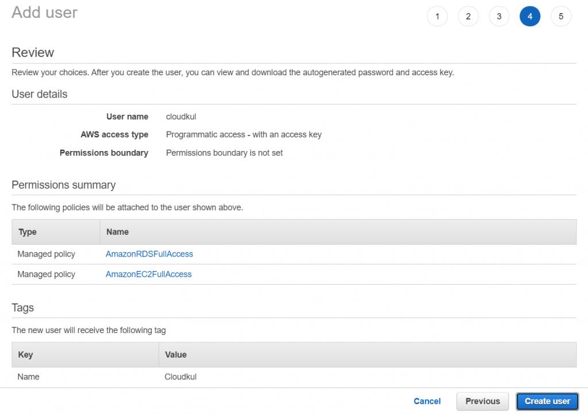

# Installing Magento 2 on AWS with Terraform and Ansible


>> References: https://cloudkul.com/blog/installing-magento-2-on-aws-with-terraform-and-ansible/

In this blog we will see Installing magento 2 on AWS with Terraform and Ansible, at the end of this blog you will be able to deploy magento 2 on AWS using terraform.

## Prerequisites
- Ubuntu 18.04
- Account on AWS
- Account on Magento
- Install terraform and ansible in server

## At here we will see
- What AWS resources are build
- How we create Access Key and Secret Key in AWS
- How we create Key Pair in AWS
- Create Public Key and Private Key in Magento
- What’s inside the tf files
- Ansible Script
- Build AWS resources by terraform script
- Initialize the folder
- Plan for the magento 2 setup
- Apply for the magento 2 setup
- Test magento 2 site
- Conclusion

## What AWS resources are build

By the help of this terraform files the AWS resources which are build.

- EC2 Instance with
    t2.micro instance type
    Attached elastic IP
- EBS Volume with
    30 GB Storage
    Volume type is General Purpose 2.
- RDS DB Instance with
    20 GB storage
    Mysql version 5.7.23
    db.t2.micro instance class
    Parameter Group attached with DB
    Enabled backup and maintenance mode
- Security Group with
    EC2 instance security group with inbound ports 22, 80, 443.
    RDS DB instance security group with inbound ports 3306.

## How we create Access Key and Secret Key in AWS

To create access key and secret key follow the procedure:

- Login to your AWS account.
- In the service section choose for "IAM" service,
- In "IAM" service in the left side slider you will find "Users".
- Click on "Users" it will get you on users page.
- At the top left of users page you will find "Add user".
- Click on "Add user" then enter the "username" and select the access type as "Programmatic access".

- When we choose "Programmatic access" at the end of this process you get Access key and Secret Key.
- Now press "next" to add permissions for the user.
- Then in this part choose "Attach existing policies directly" by searching and selecting for "AmazonEC2FullAccess" and "AmazonRDSFullAccess". After this press "next".
- Want to use tags for user then add key and value and then press "next".

- Now in this part you can review all your configuration. And then click on "Create User".

- After creating user successfully you will find button to "Download .csv" which contains Access key and Secret key.

## How we create Key Pair in AWS

If you don’t have any "Key Pair" or wants to create new one then follow this steps.

- Open AWS account.
- In "Compute" services go for "EC2" service.
- Then at left side slider of EC2 service you will find "Network and Security".
- In "Network and Security" click on "Key Pair".
- In "Key Pair" at the top right corner you will find "Create Key Pair" click on it.
- Enter the name of Key Pair, choose file format "pem" and then click on "Create".

- After creating the Key Pair the .pem extension file will automatically downloaded in your system.

## Create Public key and Private key in Magento

To create Public key and Private key follow the steps:

- Create account on https://magento.com/
- In "My Account" you will find "Marketplace", click on it.
- Then in "My Products" check for "Access Keys", and then client on "Create A New Access Key".
- After this you will find the Public key and Private key.


## What’s inside the tf files

In this tf files you will get the following terraform code.

- ec2.tf – By this we build EC2 instance along with elastic ip address.
```tf
#ec2.tf file
 
#This is use to create EC2 instance.
 
resource "aws_instance" "EC2_Instance" {
  ami             = var.ami
  instance_type   = var.type
  key_name        = var.key_name
  vpc_security_group_ids = [aws_security_group.Security_Group.id]
  tags = {
    Name = var.ec2_tag
  }
 
#This line of code is use to change the size of created root volume.
 
  root_block_device {
    delete_on_termination = true
    encrypted             = false
    volume_size           = 30
    volume_type           = "gp2"
  }
 
#By this terraform script get connected with ec2 instance and then upload and run the magento script.
 
  connection {
    type     = "ssh"
    user     = "ubuntu"
    password = ""
    #copy &lt;your_private_key&gt;.pem to your local instance home directory
    #restrict permission: chmod 400 &lt;your_private_key&gt;.pem
    private_key = file(var.pem_file)
    host        = self.public_ip
  }
 
  provisioner "local-exec" {
      command = "sleep 30 &amp;&amp; ANSIBLE_HOST_KEY_CHECKING=False ansible-playbook -u ubuntu -i '${self.public_ip},' --private-key ${var.pem_file} project-silver-main/magento-install.yml"
  }
}
 
#By this script ElasticIP is created
 
resource "aws_eip" "Instance_IP" {
  instance = aws_instance.EC2_Instance.id
  vpc = true
 
  tags = {
    Name = "Instance-IP"
  }
}
```

- provider.tf – Is use for terraform plugins which are used in this terraform script.
```tf
#provider.tf file
 
provider "aws" {
  profile    = "default"
  region     = var.region
  access_key = var.access_key
  secret_key = var.secret_key
}
```

- random.tf – Is use to generate password for RDS admin user.

```tf
#random.tf file
 
resource "random_password" "first" {
  length  = 16
  special = false
  min_lower = 8
  min_upper = 8
}
```

- rds.tf – By this we build RDS DB instance along with parameter group.

```tf
#rds.tf file
 
#Create aws mysql rds instance
 
resource "aws_db_instance" "Database_Instance" {
  allocated_storage      = 20
  storage_type           = "gp2"
  engine                 = "mysql"
  engine_version         = var.db_engine_version
  instance_class         = "db.t2.micro"
  port                   = 3306
  vpc_security_group_ids = [aws_security_group.DB_Security_Group.id]
  name                   = "DatabaseInstance"
  identifier             = var.db_identifier
  username               = "admin"
  password               = random_password.DB_Password.result
  max_allocated_storage  = 100
  skip_final_snapshot    = true
  parameter_group_name   = aws_db_parameter_group.DB_Parameter_Group.name
}
 
resource "aws_db_parameter_group" "DB_Parameter_Group" {
  name   = "magento-parameter-group"
  family = var.parameter_family
 
  parameter {
    name  = "log_bin_trust_function_creators"
    value = 1
  }
}
```

- security-group.tf – Which is use to build security groups for EC2 instance and RDS DB instance.

```tf
#security-group.tf
 
resource "aws_security_group" "Security_Group" {
  name = "Security-Group"
  description = "Allowing ssh and http traffic"
 
  ingress {
    from_port = 22
    to_port = 22
    protocol = "tcp"
    cidr_blocks = ["0.0.0.0/0"]
  }
 
  ingress {
    from_port = 80
    to_port = 80
    protocol = "tcp"
    cidr_blocks = ["0.0.0.0/0"]
  }
 
  egress {
    from_port = 0
    to_port = 0
    protocol = "-1"
    cidr_blocks = ["0.0.0.0/0"]
  }
}
 
resource "aws_security_group" "DB_Security_Group" {
  name = "DB-Security-Group"
  description = "Allowing db traffic"
 
  ingress {
    from_port = 3306
    to_port = 3306
    protocol = "tcp"
    security_groups = [aws_security_group.Security_Group.id]
  }
 
  egress {
    from_port = 0
    to_port = 0
    protocol = "-1"
    cidr_blocks = ["0.0.0.0/0"]
  }
}
```

- variables.tf – Is use to take the values for all variables use under this script.

```tf
	
#variables.tf
 
#Variables use in EC2 instance.
 
variable "access_key" {
  default = ""			#Enter AWS User Access Key
}
 
variable "secret_key" {
  default = ""			#Enter AWS User Secret Key
}
 
variable "ami" {
  default = ""			#Enter ubuntu18.04 or ubuntu20.04 AMI
}
 
variable "type" {
  default = ""			#Enter Instance Type (ex - t2.micro)
}
 
variable "key_name" {
  default = ""			#Enter pem file name without extention
}
 
variable "region" {
  default = ""			#Enter aws region code (ex - ap-south-1)
}
 
variable "pem_file" {
  default = ""			#Enter Path of pem file
}
 
variable "ec2_tag" {
  default = ""			#Give name to EC2 instance
}
 
#Variables use in RDS creation.
 
variable "db_engine_version" {
  default = ""			#Choose any version 5.7.23, 5.7.24, 5.7.25, 5.7.26, 5.7.28, 5.7.30, 5.7.31, 8.0.11, 8.0.13, 8.0.15, 8.0.16, 8.0.17, 8.0.19, 8.0.20, 8.0.21 Recommanded to choose 8.0.x version"
}
 
variable "db_identifier" {
  default = ""			#Enter identifier only in small alphabates
}
 
variable "parameter_family" {
  default = ""			#Enter the parameter family according to user choose version mysql5.7, mysql8.0
}
```


## Ansible Script

Download the ansible script from link in terraform directory and unzip the script.

Link – https://github.com/siddharthchouradiya/project-silver/archive/main.zip

When you unzip the script you will find var.yml file, please update the file according to key-value pair before run the script.

Build AWS resources by terraform script

Before we start if you didn’t install terraform in your ubuntu 18.04 then follow link.

Create a folder and then add terraform script inside the folder.

Now edit "variables.tf" files to use the terraform script.

```nano variables.tf```

And enter the values of variables according to your AWS account. After that save the file by "ctrl+x" to exit, "y" to save and press "enter".

## Initialize the folder

In this step go to the location where all the terraform ".tf" files are located.

With the help of this initialize command terraform will download the required plugins like AWS, mysql, etc.
```terraform init```

After completion of this command you will find hidden directory with name .terraform.

## Plan for the magento 2 setup

In this step after initialize the folder, with the help of this command you will check the plan of resources which are going to create after apply command.
```terraform plan```

By this command all the resources which are going to create are shown.

## Apply for the magento 2 setup

By this step we will get the execution plan to confirm the installation.

In execution plan it will show all the details of resources which will be created after installation.
```terraform apply```

After using this command it will show the execution plan and ask us to confirm that plan for further installation.

## Test magento 2 site

After all this process go to your browser and open the magento 2 site with the help of "IP address".

```http://<ip-address>```

It will show the Installation page of magento 2.


## Conclusion

With this we can easily setup LAMP server and configure ec2 and RDS in our AWS account by some commands. After completion of this we can run our magento 2 site in the browser.

Thanks you for blog post: https://cloudkul.com/blog/installing-magento-2-on-aws-with-terraform-and-ansible/